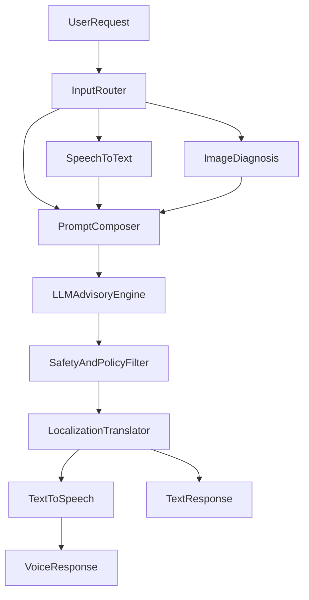

# AI Orchestration Plan

## Objective

Provide a unified assistant that supports text, image, and voice interactions in 5 languages with safe, practical farming recommendations.

## Orchestration Flow

## Components

1. Input router
   - Accepts text, voice audio, and optional image.
2. STT adapter
   - Converts voice to normalized text with language tags.
3. Vision diagnosis adapter
   - Detects likely pest/disease patterns from uploaded image.
4. Prompt composer
   - Merges farmer profile, crop stage, district weather context, and input signals.
5. LLM advisory engine
   - Generates solution with explainable steps and confidence guidance.
6. Safety filter
   - Removes unsafe chemical dosage responses and forces disclaimer rules.
7. Translation and TTS
   - Returns multilingual text and voice output.

## API Contracts (Initial)

- `POST /api/assistant/query`
  - Input: `{ language, message, imageUrl?, voice? }`
  - Output: `{ answer, confidence, actions, audioUrl? }`

## Reliability Rules

- Fallback to text advisory if STT or TTS fails.
- Fallback to symptom-based diagnosis if image analysis fails.
- Return source note and timestamp for weather/market/scheme references.
