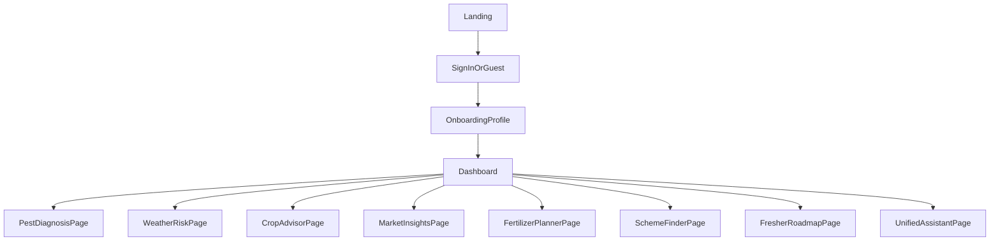

# UX Blueprint: User Flow and Module IA

## Primary Journey

## Page Inventory

1. `/` Home and language switch
2. `/onboarding` Farmer profile wizard
3. `/dashboard` All modules with quick action cards
4. `/pest-diagnosis` Image upload + recommendations
5. `/weather-risk` Forecast + risk alerts
6. `/crop-advice` Stage wise crop guidance
7. `/market` Price info + trend and prediction
8. `/fertilizer` Dosage and cost calculator
9. `/schemes` Eligibility and application guide
10. `/fresher-roadmap` Start to harvest plan + budget
11. `/assistant` Unified chat and voice assistant
12. `/settings` Language, notifications, account

## Core UI Modules

- Shared Header with language and voice shortcut
- Dashboard card grid with status badges
- Assistant chat drawer available across modules
- Advisory response card (problem, solution, cost, confidence)
- Risk alert strip (weather/price/pest urgency)
- Planner forms (land, water, crop, seed cost, fertilizer cost)

## Accessibility and Usability

- High contrast cards and large tap targets
- Voice-first input option on major forms
- Low-bandwidth mode with reduced image quality
- Local language defaults from profile
